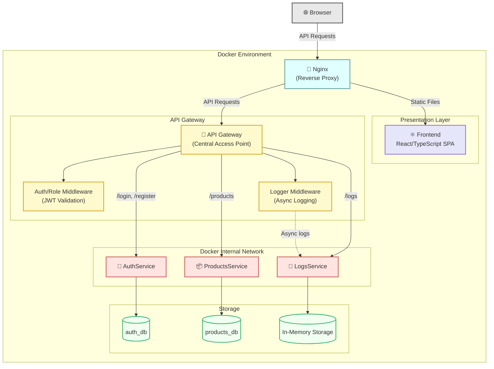
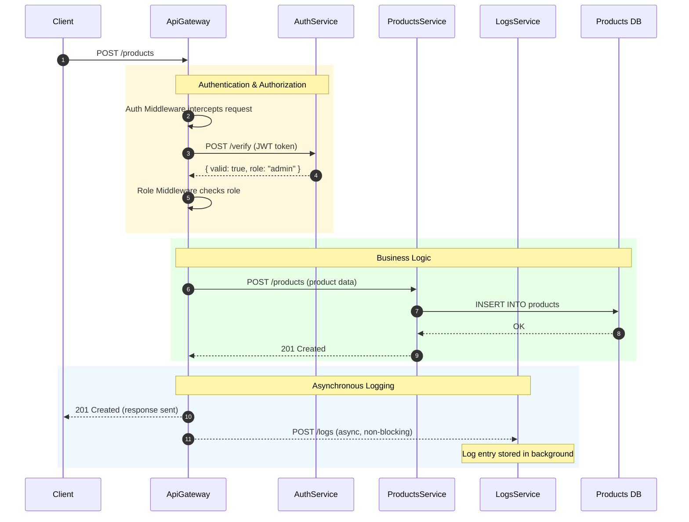
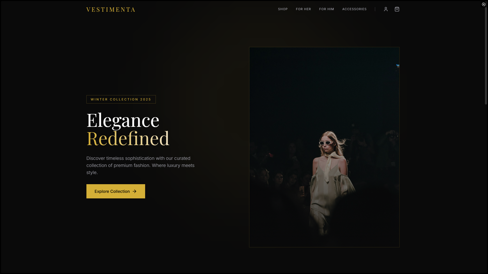
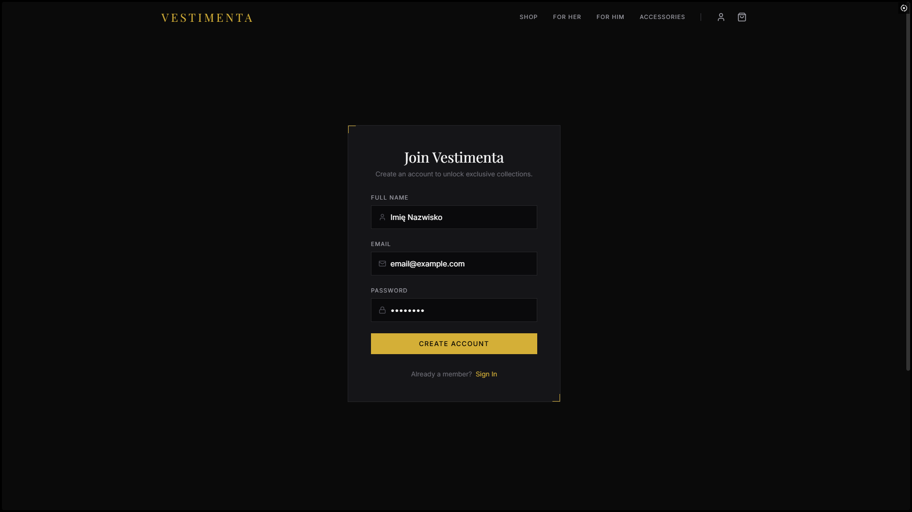
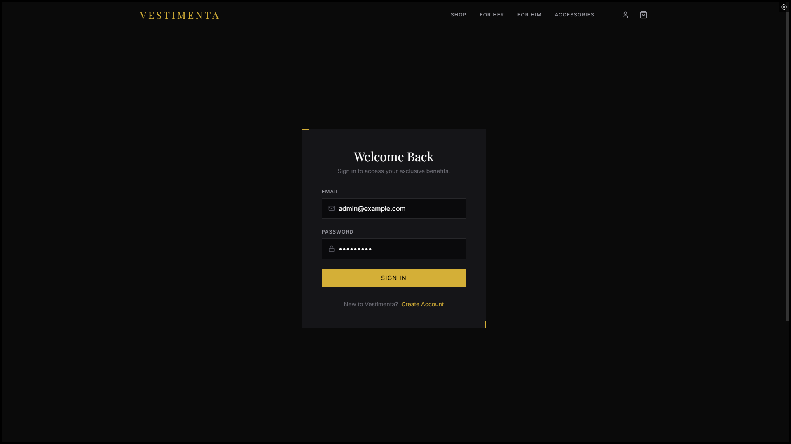
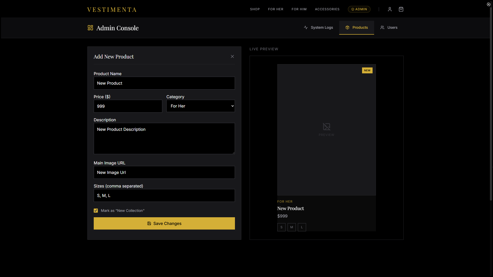
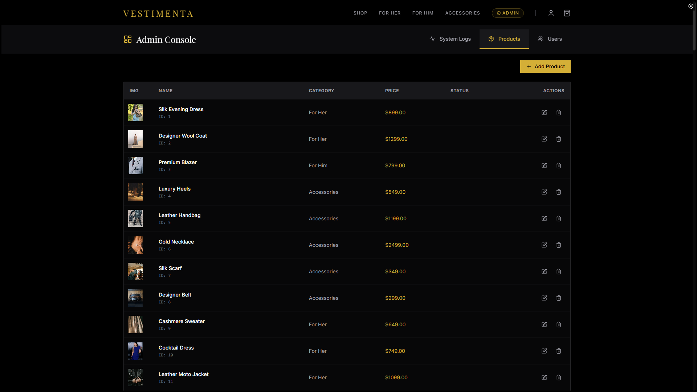
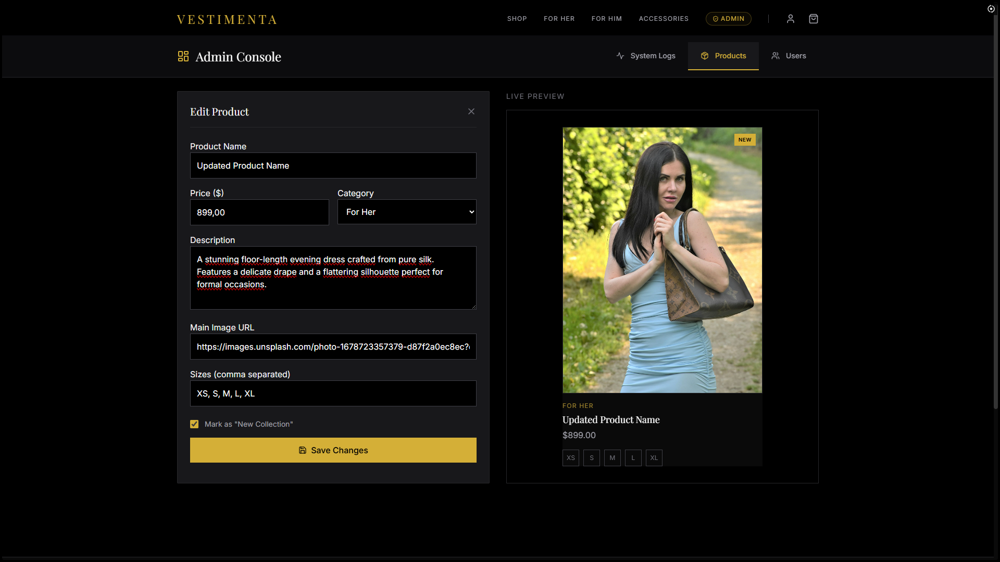
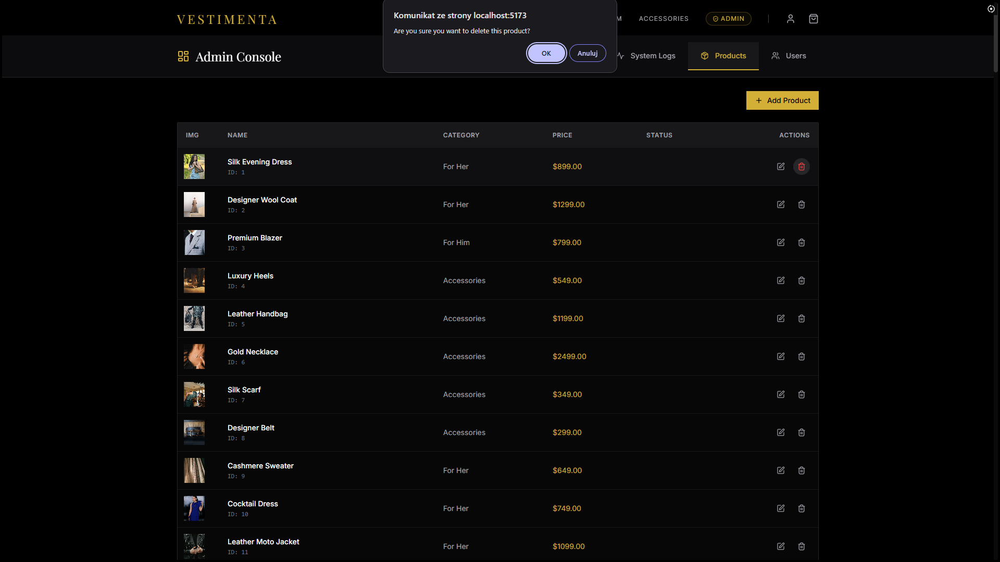
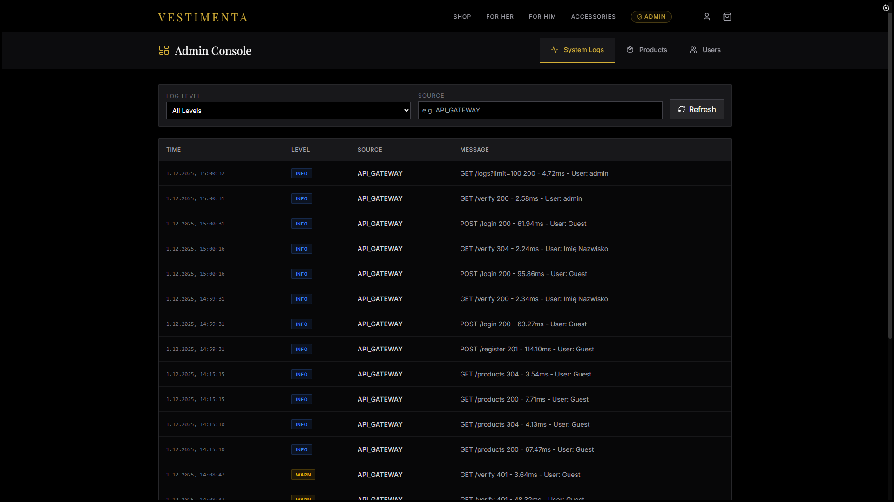

# Vestimenta — Luxury Fashion E-commerce System

A microservices-based e-commerce application where an **API Gateway** serves as the central access point. Domain services (products, orders, users) run as independent Docker containers communicating via lightweight HTTP interfaces. The presentation layer is a React frontend that aggregates data from multiple services and presents it to the user.

This project was developed as a coursework assignment for a Distributed Systems course, demonstrating practical application of distributed architecture in a `Node.js` and `Docker` environment, implementing key patterns such as API Gateway, domain separation, and service containerization.

**Repository:** [Vestimenta-microservices-architecture-uni-project](https://github.com/logyQT/Vestimenta-microservices-architecture-uni-project)

## Table of Contents

1. [Local Development Setup](#1-local-development-setup)
2. [Production Environment (Docker Compose)](#2-production-environment-docker-compose)
3. [Tech Stack & Architecture](#3-tech-stack--architecture)
4. [API Documentation](#4-api-documentation)
5. [Application Demo](#5-application-demo)

## 1. Local Development Setup

To run the project locally without containerization, manual database configuration and Node.js dependency installation for each service are required.

### Prerequisites

- **Node.js** (v18 or later)
- **PostgreSQL** (running on port `5432`)

### Database Configuration

The project requires two separate PostgreSQL databases. Create them manually using your preferred SQL client (e.g., pgAdmin, psql):

1. User database: `auth_db`
2. Products database: `products_db`

> **Default connection settings** (defined in `database.js` files):
>
> - Host: `localhost`
> - User: `postgres`
> - Password: `password`
> - Port: `5432`
>
> _If your local PostgreSQL configuration differs, set the appropriate environment variables (e.g., `DB_USER`, `DB_PASSWORD`) before starting the services._

### Installation & Running

The project uses a monorepo structure. Install dependencies for each microservice and the client, then start everything using the orchestration script in the root directory.

1. **Install dependencies:**

   Navigate to each directory and run `npm install`:

   ```bash
   # Root directory (for concurrently)
   npm install

   # Services
   cd app/Services/ApiGate && npm install
   cd ../AuthAPI && npm install
   cd ../ProductsAPI && npm install
   cd ../LoggingAPI && npm install

   # Frontend
   cd ../../Client && npm install
   ```

2. **Seed the database:**

   Run the script to create tables and populate them with sample data (users and products):

   ```bash
   npm run init-db
   ```

3. **Start the application:**

   Launches all services and the frontend in watch mode using `concurrently` and Node.js built-in `--watch`:

   ```bash
   npm run dev
   ```

   - **Frontend:** [http://localhost:5173](http://localhost:5173) (Vite dev server)
   - **API Gateway:** [http://localhost:4000](http://localhost:4000)

## 2. Production Environment (Docker Compose)

The production environment is fully containerized using **Docker** and **Docker Compose**, providing service isolation on an internal network with automatic database configuration.

### Instructions

1. **Build and start containers:**

   ```bash
   docker-compose up -d --build
   ```

2. **Seed databases:**

   The `auth-seed` and `products-seed` containers are defined in the `init` profile and do not start automatically. Run them manually to populate the databases:

   ```bash
   docker-compose run --rm auth-seed
   docker-compose run --rm products-seed
   ```

3. **Access the application:**

   The application is available at **`http://localhost`** (served by Nginx on port 80).

4. **Stop the environment:**

   ```bash
   docker-compose down -v
   ```

## 3. Tech Stack & Architecture



The project implements a microservice architecture pattern with a central access point (API Gateway) and separation of the presentation layer.

### Frontend (Client)

- **Stack:** React 18, TypeScript, Vite
- **Styling:** Tailwind CSS (including typography and animations)
- **State Management:** React Context API (`AuthContext`, `CartContext`)
- **HTTP Client:** Axios
- **Routing:** React Router DOM (HashRouter)

### API Gateway

- **Technology:** Node.js, Express
- **Role:** Acts as a **reverse proxy** and aggregator — the single point of contact for the frontend
- **Middleware:**
  - **Auth Middleware:** Verifies JWT tokens by making a synchronous request to AuthAPI (`POST /verify`)
  - **Logger Middleware:** Asynchronously sends request metadata (method, duration, user) to LoggingAPI
  - **Role Middleware:** Enforces role-based access control (admin/user)
- **Communication:** Forwards requests to microservices (AuthAPI, ProductsAPI) via internal HTTP calls (Axios)

### Microservices (Backend)

Each service owns a specific domain and (mostly) its own database.

1. **Auth Service** — User registration, login, management, and JWT token verification
   - Database: PostgreSQL (`users` table)
   - Security: Password hashing via `bcrypt`

2. **Products Service** — CRUD operations for products
   - Database: PostgreSQL (`products` table)

3. **Logging Service** — System log aggregation
   - Storage: In-memory (process RAM)

### Production Networking

In Docker Compose, services communicate on a dedicated internal network (`internal_net`) not accessible from outside:

- `api-gateway` resolves services by hostname: `http://auth-service:4002`, `http://products-service:4003`, etc.
- The frontend communicates exclusively with Nginx (port 80)

### Example Request Flow

The sequence diagram below shows the full lifecycle of a `POST /products` request, from client initiation (Admin) through database write to final response. It illustrates the API Gateway's role as the flow coordinator — managing authentication, authorization, and monitoring.

**Flow description:**

1. **Identity & Role Verification** — The request is immediately intercepted by Auth Middleware, which makes a synchronous call back to Auth Service (Step 3) to validate the JWT and retrieve the user's role. Only after token validation does Role Middleware verify the user has the required role (`admin`). This stage blocks further processing until authorization succeeds.

2. **Business Logic** — After authorization, API Gateway forwards the request to Products Service, which writes data to Products DB.

3. **Asynchronous Logging** — After Products Service completes the operation (Step 8) and prepares the client response (e.g., `201 Created`), API Gateway initiates a non-blocking call to Logging Service (Step 10). The system log is written in the background while the client receives its response immediately, minimizing latency.

**Two critical conditions must be met for `POST /products` to succeed:**

- **Authentication:** The client must include a valid JWT in the `Authorization` header
- **Authorization:** The user encoded in the token must have the `admin` role



### Nginx Role

In production, Nginx serves a dual role (configured in `nginx.conf`):

1. **Web Server** — Serves the built React SPA from `/usr/share/nginx/html`
2. **Reverse Proxy** — Routes requests starting with `/api/` to the `api-gateway` container on port `4000`
   - This eliminates **CORS** issues (Same-Origin Policy) since both frontend and API are served under the same domain/port
   - The client Dockerfile rewrites the `base URL` in `api.ts` from `http://localhost:4000` to the relative path `/api`, enabling proper routing through Nginx

## 4. API Documentation

The following are the key endpoints exposed by **API Gateway**.

### Public

No authorization token required.

| Method | Endpoint | Description |
|--------|----------|-------------|
| `GET` | `/` | API Gateway health check |
| `POST` | `/login` | User login — forwards credentials to Auth Service, returns JWT |
| `POST` | `/register` | Register a new user |
| `GET` | `/products` | List all products (supports query params for filtering) |

### User

Requires `Authorization: Bearer <token>` header.

| Method | Endpoint | Description |
|--------|----------|-------------|
| `GET` | `/me` | Get current user profile |
| `PATCH` | `/me` | Update profile (email, name) |
| `DELETE` | `/me` | Delete own account (password confirmation required) |

### Admin

Requires a token with the `admin` role.

| Method | Endpoint | Description |
|--------|----------|-------------|
| `GET` | `/users` | List users (filterable by `role`, `username`, `email`) |
| `POST` | `/users` | Create a new user |
| `PUT` | `/users` | Full user update (overwrite) |
| `PATCH` | `/users` | Partial user update |
| `GET` | `/logs` | Retrieve system logs from LoggingAPI |
| `GET` | `/health` | Health check across all microservices (Gateway queries each service's `/health` endpoint) |

## 5. Application Demo

### 5.1 Landing Page



### 5.2 User Registration



### 5.3 User Login



### 5.4 Admin Product CRUD

#### Create



#### Read



#### Update



#### Delete



### 5.5 Admin System Logs


